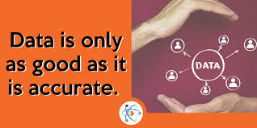
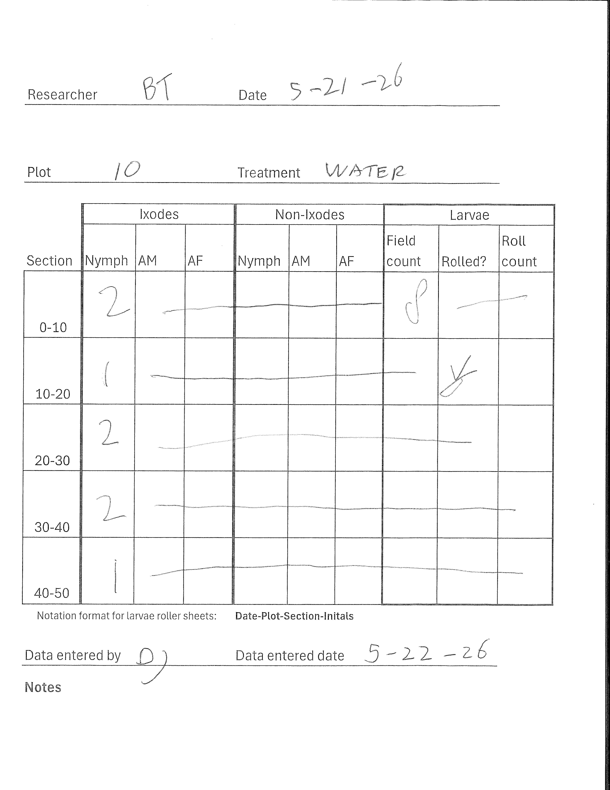
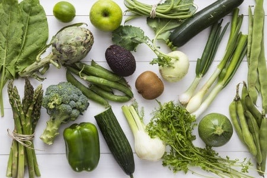
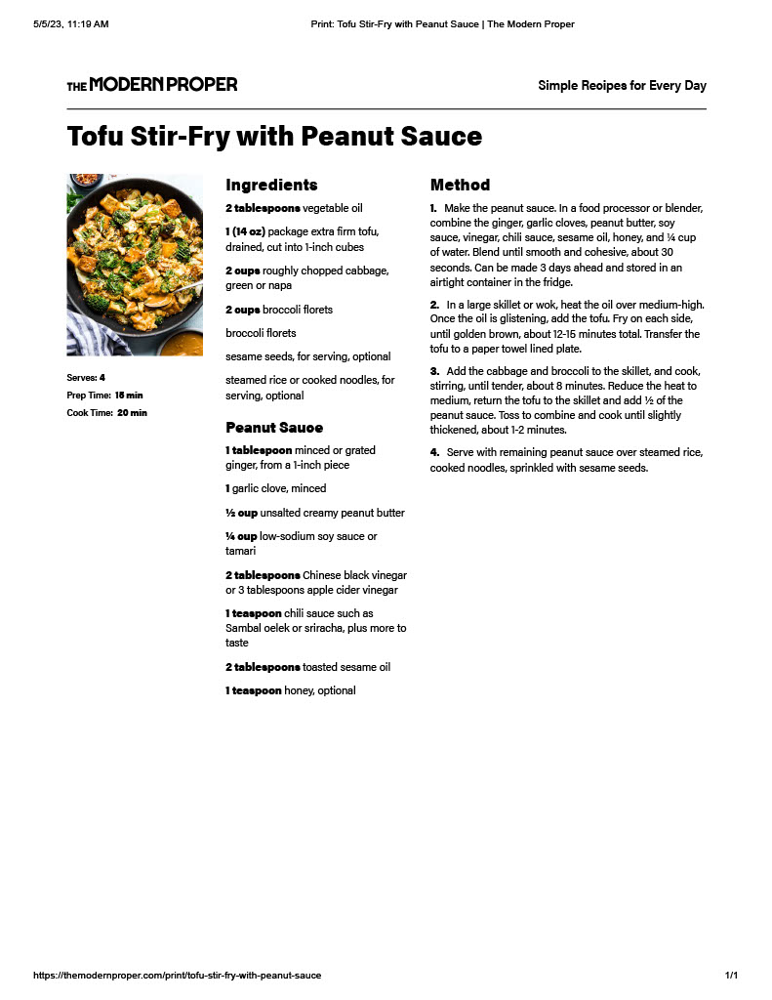
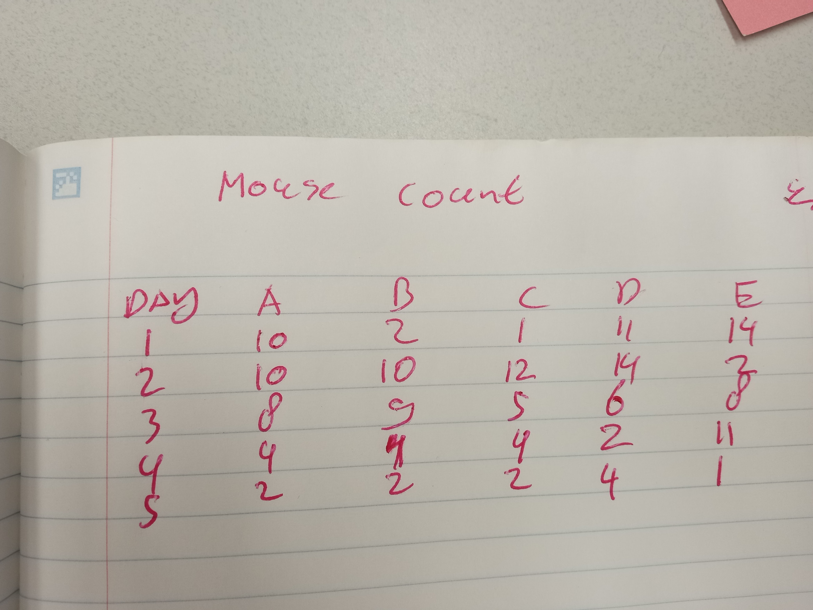
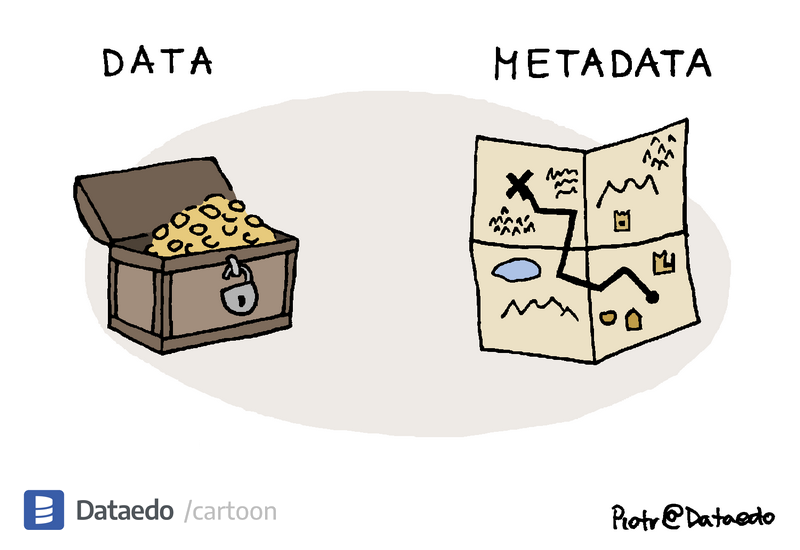
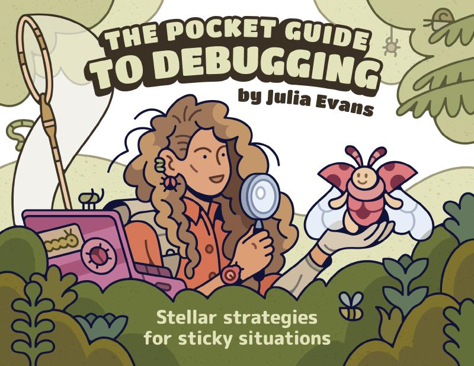

## About me: David Jansen

-   BSc and MSc Nature Concervation and Ecology at University of Wageningen, The Netherlands
-   Several years as field scientist\
-   PhD Animal communication at University of Zurich, Switzerland
-   Research Scientist at Notre Dame university and Amboseli Baboon research project
-   Since 2023 Data scientist at MCEVBD

## Study animals


# Content

```{r}
knitr::opts_chunk$set("ft.shadow" = FALSE)
library(tidyverse)
```

-   Data collection

-   Field data collection

-   Data management

## Importance of good data

{fig-align="center" width="900"}

## Importance of good data

-   Good data leads to good science

::: fragment
-   “Garbage in, garbage out” – no analysis can save bad data
-   “Accuracy isn’t about perfection — it’s about responsibility.”
-   You can’t fix bad data with good statistics
:::

# Field data collection

## Uniqueness of fieldwork

-   One-time opportunity: You can’t redo fieldwork
    -   once it’s done, it’s done.

::: fragment
-   High cost:
    -   Fieldwork involves lots of time, travel, and staff
:::

::: fragment
-   Unpredictable conditions:
    -   **Weather**, animals, insects and the environment add complexity
:::

## Data collection sheets

-   Your lab notebook from the field
    -   This is the raw data of the project

::: incremental
-   Your entries might be entered by other people
    -   Clear handwriting is essential (**also for numbers**)
        -   Ask Brad for details :-)
    -   consistent entries
    -   standardized formats
    -   Add notes if needed
:::

## Notes

-   Notes are really helpful when sorting issues later

{fig-align="center" width="900"}

## Blank versus 0

-   0 means that you did not find a tick
-   Blank means you don’t have information about ticks
    -   You looked for ticks and found none
    -   You looked for ticks, but did not record what number you found
    -   You did not look for ticks, so you don't know how many ticks there are.
-   **Important:** Computers interpret blanks as **NA** (missing data), which means *unknown*.

## Date Formats Matter

-   Be consistent.
    -   Don’t mix formats like 3/5/25
        -   March 5 (USA)
        -   May 3 (rest of the world)
    -   ISO format: YYYY-MM-DD (e.g. 2025-05-15)
    -   ddMMMyy: (e.g. 15MAY25)
-   When entering data watch out for auto-formatting in spreadsheets!
    -   ddMMMyy format is save as it is seen as text

## Easy quick data check

-   Check sheets before you leave field (or let animal go)
-   Did you collect all data you need
    -   Where all plots sampled?
    -   Do you have all tubes?
    -   Do we have all the larvae sheets?
    -   Is everything labeled correctly?

<!-- ## Data collection sheet -->

<!-- -   Example of a data collection sheet -->

<!-- {fig-align="center" width="900"} -->

## Easy quick data check

{fig-align="center" width="900"}

## Delay between collection and data analysis

-   The data often only analysed months after collection
-   Fixing mistakes (if possible) cost a lot of time

## Examples of problems last years

{fig-align="center" width="900"}

## Examples of problems last year

{fig-align="center" width="1200"}

## Data entry

-   Do this is as close to collection as possible
-   If anything is unclear ask person who collected the data
-   Should not be an afterthought
-   If possible enter data twice
-   Be accurate

## Take home message

::: fragment
-   Be accurate
-   Check sheets if they are completed
-   **no blanks**
-   Your hard work is only valuable if data is recorded
-   As many notes if needed
:::

::: fragment
If we can all do this we can avoid


:::

::: fragment
and be


:::

# Data management

## Data (1)

-   Keep an as raw as possible version

    

## Data (1)

-   Keep an as raw as possible version
-   Consider making your original data file read-only
-   keep in a 'save' format
-   Preferably not excel format - transferring between platforms can cause an issue (e.g. dates)
-   But sometimes it is useful
-   csv, tsv, maybe text
-   Don't make changes to this raw data

## Data (2)

-   Content of columns in correct data type and units
-   character (e.g, "a", "swc")
-   numeric (real or decimal) (e.g, 2, 2.0)
-   logical (FALSE, TRUE)
-   integer (e.g, 2L, as.integer(3))
-   complex (e.g, 1 + 0i, 1 + 4i) \<- These can be annoying

::: aside
R sees logical as 0/1 (FALSE/TRUE). This can be handy during coding.
:::

## Data (3)

-   Try to have content of columns in correct data type and units
-   An example why this ~~can~~ is important

```{r, eval=TRUE}
tibble(species = c("elphant", "mouse", "cheetah"),
       speed = c("24.0 mph", "8.1 mph", "74.6 mph"),
       speed_mph = c(24, 8.1, 74.7)) %>% 
  #knitr::kable(digits = 1) %>% 
  #kableExtra::kable_classic(full_width = F, html_font = "Cambria")
     flextable::flextable() %>% 
     flextable::fontsize(size = 30, part = "all") %>% 
     flextable::colformat_double(digits = 1) %>%  
     flextable::width(j = 2, 2, unit = "in")
```

## Data (3)

::::: {,columns}
::: {.column width="45%"}
```{r}
tibble(species = c("elphant", "mouse", "cheetah"),
       speed = c("24.0 mph", "8.1 mph", "74.6 mph"),
       speed_mph = c(24, 8.1, 74.7)) %>% 
  ggplot(aes(x = species, y = speed)) +
    geom_col() +
    cowplot::theme_cowplot()

```
:::

::: {.column width="45 %"}
```{r}
tibble(species = c("elphant", "mouse", "cheetah"),
       speed = c("24.0 mph", "8.1 mph", "74.6 mph"),
       speed_mph = c(24, 8.1, 74.7)) %>% 
  ggplot(aes(x = species, y = speed_mph)) +
    geom_col() +
    cowplot::theme_cowplot() +
     scale_y_continuous(expand = c(0, 0), breaks= scales::pretty_breaks()) +
labs(y = "speed (mph)")
```
:::
:::::

## Data (4)

-   Use a scripted program not only for analysis, but also for ***data cleaning*** and ***data wrangling***

## Data (4)

-   Use a scripted program not only for analysis, but also for ***data cleaning*** and ***data wrangling***

-   reproducible

    {fig-align="center"}

## Data (4) {.smaller}

-   Use a scripted program not only for analysis, but also for ***data cleaning*** and ***data wrangling***
-   reproducible
-   Keep raw version safe !!!

::: {.column width="35%"}
{fig-align="center"}
:::

::: {.column width="60%"}
```{r, eval=TRUE}
raw_data_wide <- tibble(day = c(1,2,3,4,5),
               House_A = c(10, 10, 8, 4, 2),
               House_B = c(2, 10, 9, 4, 2),
               House_C = c(1, 12, 5, 4, 2),
               House_D = c(11, 14, 6, 2, 4),
               House_E = c(14, 2, 8, 11, 1))

raw_data_wide %>% 
  #knitr::kable(digits = 1) %>% 
  #kable_classic(full_width = F, html_font = "Cambria")
  flextable::flextable() %>% 
  flextable::colformat_double(digits = 1) 
```
:::

## Data (4) {.smaller}

-   Use a scripted program not only for analysis, but also for ***data cleaning*** and ***data wrangling***

-   reproducible

-   Keep raw version safe !!!

-   Lyric: "House E used pesticides and should be excluded for this study"

```{r, echo=  TRUE, eval =FALSE}
 raw_data_wide %>% 
  select(-House_E) %>%    ## The owners used pesticides during the trials
  flextable::flextable() %>% 
  flextable::colformat_double(digits = 1)
```

## Data (4) {.smaller}

-   Use a scripted program not only for analysis, but also for ***data cleaning*** and ***data wrangling***

-   reproducible

-   Keep raw version safe !!!

-   Lyric: "House E used pesticides and should be excluded for this study"

-   A few months later...

    -   Lyric: "I changed my mind about house E, because it was only done in the front yard"

        -   "Sorry I deleted that data" versus "Let me rerun code"

## Wide format versus long format {.smaller}

::::: columns
::: {.column width="70%"}
```{r, eval=TRUE}
raw_data_wide %>% 
  #knitr::kable(digits = 1) %>% 
  #kable_classic(full_width = F, html_font = "Cambria")
  flextable::flextable() %>% 
  flextable::colformat_double(digits = 0)
```

-   wide often easier for recording
-   long often required for analysis
:::

::: {.column width="30%"}
```{r, eval=TRUE}
raw_data_wide %>% 
  pivot_longer(names_to = "houses",
               values_to = "tick_count",
               cols = -day) %>% 
  slice(1:20) %>% 
  #knitr::kable(digits = 1) %>% 
  #kable_classic(full_width = F, html_font = "Cambria")
  flextable::flextable() %>% 
  flextable::colformat_double(digits = 0)
```
:::
:::::

## Data documentation (1)

{fig-align="center" width="600"}

::: callout-tip
You know details of project and data structure (at this moment), but what about future you or others.
:::

## Data documentation (2) {.smaller}

-   **README**

    ::: fragment
    <ul>

    <li>One per dataset</li>

    <li>Provide a title for the dataset</li>

    <li>Brief description per column</li>

    <li>Publicly available data may need more details</li>

    <li><a href="https://guides.lib.uci.edu/datamanagement/readme">UC Irvine README guide</a></li>

    </ul>
    :::

-   **Metadata**

    ::: fragment
    <ul>

    <li>Data about data</li>

    <li>Often 1 per study</li>

    <li>

    Information does generally not change

    <ul>

    <li>e.g. details on study sites</li>

    </ul>

    </li>

    <li><a href="https://datadryad.org/stash/best_practices">Dryad Best Practices</a></li>

    </ul>
    :::

## Naming

-   Use descriptive names for folders, files and variables
-   Understandable but not to long
-   m1 versus glm_count_full
-   data versus tick_counts_GH

::: callout-tip
While a computer will ultimately run your code, it'll be read by humans, so write code intended for humans!
:::

## Naming {.smaller}

-   Be aware on naming rules of programs

    -   Avoid special characters (\$, \@, \*)

    -   **No spaces !!**

    -   Case-sensitive (e.g. R) versus case insensitive (SQL)

    -   R (and many other languages) names can't start with numbers

    -   'car speed in miles per hour' versus 'car speed (mph)' versus **car_speed_mph**

## Naming {.smaller}

-   Be aware on naming rules of programs
-   styles
    -   camelCase
    -   PascalCase
    -   snake_case
-   be consistent

# Take home

-   keep raw data raw
-   use code to clean data
-   document code and data
-   ***No Spaces :-)***

<!-- {fig-align="center" height="40%"} -->

<!-- and be -->

<!-- {fig-align="center" height ="40%"} -->

## Bonus

{fig-align="center"}

## How to deal with R (programming) errors {.smaller}

1.  don't get frustrated by error messages

2.  read the error message

3.  google the error message

4.  google solutions or use ChatGPT

5.  trial and error

    a.  it works --\> go back to your analysis

        {width="100"}

    b.  error -\> go back to 1.git stat
